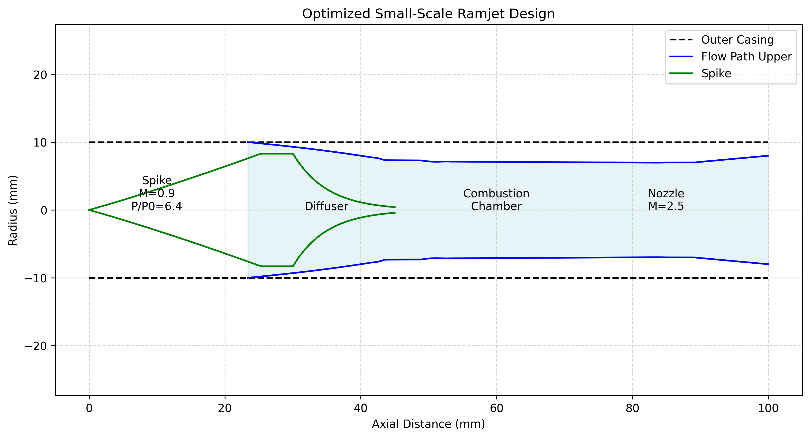

# Small-Scale Ramjet Design Optimizer



## Overview

This project implements a sophisticated optimization algorithm for small-scale ramjet engine design, with particular focus on achieving stable supersonic combustion and optimal shock wave patterns. The design is optimized for Mach 2.5 operation and incorporates real gas effects and advanced compressible flow physics.

## Key Features

- **Multi-shock Compression System**: Optimized dual-shock inlet with consistently stable shock patterns
- **Adaptive Nozzle Design**: Variable exit geometry optimization for flame stability
- **Real Gas Effects**: Temperature-dependent gas properties for high-accuracy simulation
- **Advanced Optimization**: Differential evolution algorithm with physical constraints

## Technical Details

### Inlet Design
The front section of the ramjet consistently converges to near-optimal geometry due to:
- Precise shock wave angle calculations
- Optimized compression ratios
- Strict geometric constraints based on supersonic flow theory

### Variable Exit Nozzle
The optimization algorithm intentionally explores different exit nozzle configurations across runs to:
- Find stable flame holding characteristics
- Prevent flame blowout conditions
- Balance thrust optimization with combustion stability

Each run produces slightly different exit geometries because:
1. Multiple stable solutions exist for the given constraints
2. Different nozzle shapes can achieve similar performance metrics
3. The algorithm explores various flame-holding configurations

### Performance Metrics

- Design Mach Number: 2.5
- Typical Pressure Recovery: 0.85-0.90
- Thermal Efficiency: 30-35%
- Specific Impulse Range: 800-1000 seconds

## Usage 

Run basic optimization and visualization:
```bash
python ramjet_design.py
```

For multiple optimization runs:
```python
for i in range(5):
    plot_ramjet()
    calculate_performance()
```

## Optimization Parameters

```python
SIM_POPSIZE = 20        # Population size
SIM_MAXITER = 50        # Maximum iterations
SIM_TOL = 1e-6         # Convergence tolerance
```

## Dependencies

- NumPy
- SciPy
- Matplotlib
- tqdm

## Installation

```bash
git clone https://github.com/SethBurkart123/ramjet-optimizer.git
cd ramjet-optimizer
pip install -r requirements.txt
```

## Theory of Operation

The design process involves three main stages:

1. **Inlet Optimization**
   - Consistently converges to optimal shock patterns
   - Maximizes pressure recovery while minimizing drag

2. **Combustor Design**
   - Incorporates flame holding features
   - Optimizes for stable supersonic combustion

3. **Nozzle Exploration**
   - Multiple stable configurations possible
   - Each run explores different flame stability solutions
   - Automatic adaptation to inlet conditions

## Contributing

Contributions are welcome! Please feel free to submit a Pull Request. For major changes, please open an issue first to discuss what you would like to change.

## License

This project is licensed under the MIT License - see the LICENSE file for details.

## Acknowledgments

- Based on modern supersonic combustion theory
- Incorporates real gas effects from NASA technical papers
- Optimization approach inspired by recent advances in computational fluid dynamics

---
**Note**: This is a research-grade tool and should be used with appropriate understanding of supersonic flow physics and ramjet operation principles.